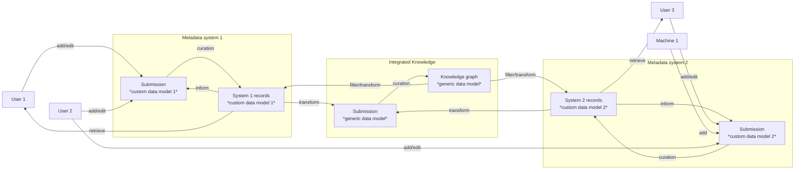

# Usage considerations

The schema building blocks provided here can be use with a lot of flexibility.
Nevertheless, some usage patterns may result in more efficient workflows than
others.

This page illustrates a few aspects that may be worth evaluating when building
metadata systems.

## A proposal of a metadata system of focused, interoperable components

The system uses a layered approach to orchestrate different metadata providing
and consuming processes, such that they all contribute to and are informed by
an integrated and curated knowledge base.

Human and machine users interact directly with individual UIs and APIs that
are purpose-built for specific applications and capabilities. Each of them
uses their own data models. Each system allows for submission of additional
or edited records to a staging area where submissions can be subjected to
verification and curation, before they are accepted.

Metadata records from each system can be losslessly transformed to be compliant
with a generic use case agnostic data model. This generic data model
facilitates the integration of information across applications and workflows.
Transformed metadata records are, again, submitted for curation and integration
into a central knowledge base.

This central knowledge base can be queried to produce integrated reports.
Knowledge base records can also be exported to the data models of individual
metadata systems to inform particular applications.

## Curation workflows

Depending on the nature of the metadata and the respective audiences for producing
consuming metadata, curation workflow differ substantially. The following sections
collect some ideas and constraints to keep in mind when designing such workflows
in this context.

### Design schemas to reduce churn

Data models should be designed to prefer linkage to broader, more slowly evolving,
less context constrained entities. For example, the relationship between a
container-type entity and its parts could be implemented by a `part_of`
relationship, rather than a list of `parts` in the container. This enables
the addition of a new part via the creation of a single, additional record
-- as opposed to having to create the new record, and then also having to update
the part-list.

This design choice does not limit the on-demand construction of part-lists
for "runtime" representations of knowledge for query-focused applications.
But it reduces to load on data curation workflows, by reducing the number of
events that require knowledge merge operations, in favor of plain additions.

However, not in all cases the "part" is the most constraint entity. For example,
a file can be a member in more than one archive. In such cases, it can be more
efficient to use a "static" part record, and track parts in the respective
containers.

### PIDs also require curation

Persistent identifiers (PID) play a key role in this metadata concept. Data
models and vocabularies can change flexibly, but records still describe one and
the same `Thing` when the PID is identical.

Persistent identifiers allow referencing entities in contexts where not all
information about an entity is available. One can reference a `Person` without
having to reveal possibly sensitive information about that `Person` at the same
time. For example, a public `Person` record about an academic may only contain
a name and a work contact email (equivalent to the information available on
a corresponding author in a journal publication). At the same time, an internal
`Person` record would have additional information, like a private cell phone number.
The public record can be generated from the richer, internal record by stripping
information.

#### PIDs may require mapping

However, an identifier itself can also carry information. For example, an ORCID
identifier typically can be used to reveal the name of a person. Hence when an
ORCID is used as the PID for a metadata record, any place where the identifier
is mentioned, also reveals the name of the person.  If the identifier used for
an internal, protected record and a corresponding public record are the same,
cross-referencing may be enabled unintentionally.

In such cases, it can be necessary to maintain mapping tables for PIDs of the
same entity in different contexts.

Maintaining a separate PID mapping is also an instrument to aid (future)
anonymization of records. When the mapping is destroyed (and other conditions
are fulfilled too), a PID-based re-identification is potentially made impossible.

#### PIDs may require curation

When metadata records are submitted by non-experts these records already need to have
PIDs in order to enable submission of multiple, interlinked records. It is advisable
to use dedicated (actually only temporarily persistent) PIDs for this purpose.

The reason is that a submitter cannot necessarily be trusted to use the PID of an
existing record to make further statements. Instead, they may create a new record,
with the same information as an existing one, and consequently use a new PID to link
information to this entity. While a curation could keep both records, and declare them
"same as" of each other, this needlessly inflates the number of records, increases
the maintenance load, and complicates queries.

Instead, curation could merge the two records found to be on the same entity,
and retain only the already existing one, and therefore just one relevant PID.
Subsequently, all PID references of the duplicate record in the submission
could be replaced with this original PID.

Using a dedicated PID space for pre-curation PIDs, such as
`myconsortium:pending/<random-id>` can help the curation process by making them easier
to detect. Moreover, using random, auto-generated PIDs for new, pre-curation
records also eases the tasks for submitters. They do not have to learn and follow
possible rules for PID generations, such as using particular PID systems for certain
types of records (e.g., DOIs for publications, ORCID for researchers, ROR IDs for
organizations, RRIDs for resources, etc). This task could be left to professional
curators.
